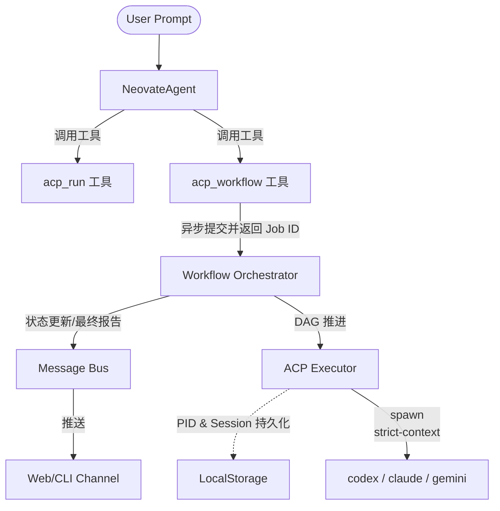

# Neoclaw ACP 多编程工具编排技术设计（最终整合定稿）

日期：2026-03-10
文档状态：Final Draft
整合人：基于 Codex 初稿、Claude Code 工程审阅、Gemini 架构审阅整合

---

## 1. 背景与目标

为了支持自然语言指令驱动的跨模型、多工具协同开发（如：“先让 codex 和 claude code 做方案，再让 gemini-cli 开发”），Neoclaw 需要引入一套能够长期稳定运行的编排子系统。

### 核心目标（v1.0）
1. **多工具统一接入**：支持 codex / claude / gemini 的标准调度。
2. **强工作流编排**：确立“提议-审查-实施-验证”的业务级流水线。
3. **长期运行稳定性**：处理长时任务超时、崩溃恢复、状态持久化。
4. **人机共驾协作 (HITL)**：实现任务的可插拔、断点挂起与用户介入。
5. **基础设施对齐**：与 Neoclaw 现有的 `createTool`、`MessageBus` 标准完全整合。

---

## 2. 总体协作架构

系统由三个主要层级构成：

1. **接口聚合层**：遵循 Neoclaw 原生 `createTool` 模式暴露出 `acp_run` 和 `acp_workflow`。
2. **异步编排层 (Workflow Orchestrator)**：处理 DAG 流水线、任务挂起、异步事件派发及 MessageBus 交互。
3. **隔离执行层 (ACP Executor)**：管理物理底层的 `acpx` 进程、日志采集、生命周期及由于重启产生的 PID 会话恢复。

---

## 3. 核心机制设计

### 3.1 异步作业机制（解决超时痛点）
传统的大模型工具调用是同步阻塞的。由于代码生成和验证耗时极大，`acp_workflow` 必须设计为**异步返回**：
* 工具触发后立即生成独立 `runId` 并进入后台挂起。
* 工具立刻返回 `{"status": "started", "jobId": "xxx", "message": "工作流已在后台启动"}` 给主 Agent，防止 LLM 等待超时。
* 后续每个步骤完成或整体结束时，通过向系统 `MessageBus` 发布 `InboundMessage` 通知会话线程。

### 3.2 崩溃恢复与进程追踪 (Orphan Process Prevention)
* 每次通过 `acpx` 启动底层 Agent 会话时，Executor 必须在磁盘（如 `workspace/state/acp-sessions.json`）记录 `{ runId, stepId, pid, startedAt }`。
* **Reconciliation（协调机制）**：Neoclaw 启动时触发巡检，如果发现悬空 `PID` 仍在运行且状态为未完成，则尝试重新侦听标准输出或妥善关闭，避免僵尸进程霸占资源。

### 3.3 严格的工件交接 (Artifact Hand-off Contract)
摒弃“全局工作区透传”做法，防止下游 Agent 上下文爆炸卡死（幻觉防御）：
* 每步必须通过输出 manifest 文件指明：“传给下游的核心设计文档是什么”，“哪些只是运行追踪日志（丢弃不传）”。
* 下游启动时，Executor 拦截过滤，只挂载必要的极简核心 Context 供其阅读。

---

## 4. 多 Agent 协同流：Proposer-Critic 模式

抛弃不切实际的“多模型并行规划再融合”模式，改为**串行对抗协作**，以减少合并时产生的幻觉。

**标准模板流程：**
1. **`plan_propose` (推荐 codex)**: 接收原始需求，生成第一版技术架构与目录骨架。
2. **`plan_review` (推荐 claude)**: 仅读取上一阶段的产物，进行安全性、边界异常与架构合理性 Review 并修改。
3. **`implement` (推荐 gemini)**: 锁定需求只读模式（`approve-reads` + 设计文档 Context），负责纯代码实现。
4. **`validate` (本地执行器)**: 运行静态自检和用户定义的 Test 脚本。

---

## 5. 人机协同与错误处理 (HITL & Suspend)

避免“无意义的重试死循环”。在步骤卡死或验证失败时：
1. **重试机制**：仅处理网络或偶发的执行器错误（退避重试）。
2. **断点挂起 (Suspend)**：业务级失败（例如依赖无法解析、Gemini 修改三次仍报错），将工作流状态变更为 `suspended_waiting_for_user`。
3. **用户介入**：通过 Web UI 显示当前卡点。用户进入终端手动解决依赖问题后，点击页面上的“恢复执行 (Resume)”，由 Orchestrator 接管并驱动下游阶段。

---

## 6. 与 Neoclaw 现有体系的整合边界

### 6.1 工具定义的对齐
必须严格采用现有的 `createTool()` + Zod Schema 工厂模式。
* `acp_run`: 供单次、简单指派任务，同步等待（设置合理 Timeout）。
* `acp_workflow`: 供长期项目生成任务，异步 Job 返回。

### 6.2 与 SubagentManager 的职能划分
* **SubagentManager**: 侧重于会话内**交互式**的子节点派生，主打“主从式问答/辅导”。
* **ACP Orchestrator**: 侧重于**非交互式**的、离线或后台的刚性“生产流水线”。
（两者共存。复杂的研发管线走 ACP，碎片化的特定代码逻辑研究走 Subagent。）

### 6.3 目录与配置挂载点
在现有扁平 `Config` 结构之下：
* 不强行嵌套深层 `agent.acp`，而在顶层引入 `acp` 配置区块处理（与 `agent` / `channels` 齐平）。
* 明确路径限制（CWD Bounding）：默认限制在 `Config.workspace.baseDir` 内，防止工具越权读写宿主关键文件。

---

## 7. 分期实施与交付路线图

为控制研发风险，建议按照 Claude Code 提出的三步走策略，叠加上文修正：

### P0 阶段：基础执行面 (v1-beta)
* **目标**：打通单模型、稳定健壮的命令行调度。
* **清单**：
  - 实现 `AcpExecutor`（具备 PID 追踪与基础 CWD 安全限制）。
  - 实现 `acp_run` 工具（采用 `createTool` API）。
  - 处理脱敏输出与错误转换（不重试，直接透传报错）。

### P1 阶段：主干工作流引擎 (v1-ga)
* **目标**：实现异步“提议-审查-开发”完整切面。
* **清单**：
  - 引入 `acp_workflow` (异步 API)。
  - 实现基于 `MessageBus` 的状态广播与通知返回。
  - 写死串行的 `Proposer-Critic` 标准模板（Codex -> Claude -> Gemini）。
  - 引入工件交接隔离策略，防止上下文爆炸。

### P2 阶段：人机共驾与 Web 面板 (v1.1)
* **目标**：实现复杂流的断点恢复与可视化运营。
* **清单**：
  - 支持 `suspended_waiting_for_user` 断点挂起态。
  - 在 Web UI 中添加 ACP Runs 工作流视图，支持查日志与点击“Resume”。
  - 定时或冷启动对僵尸进程进行清理的 Reconciliation 守护。
