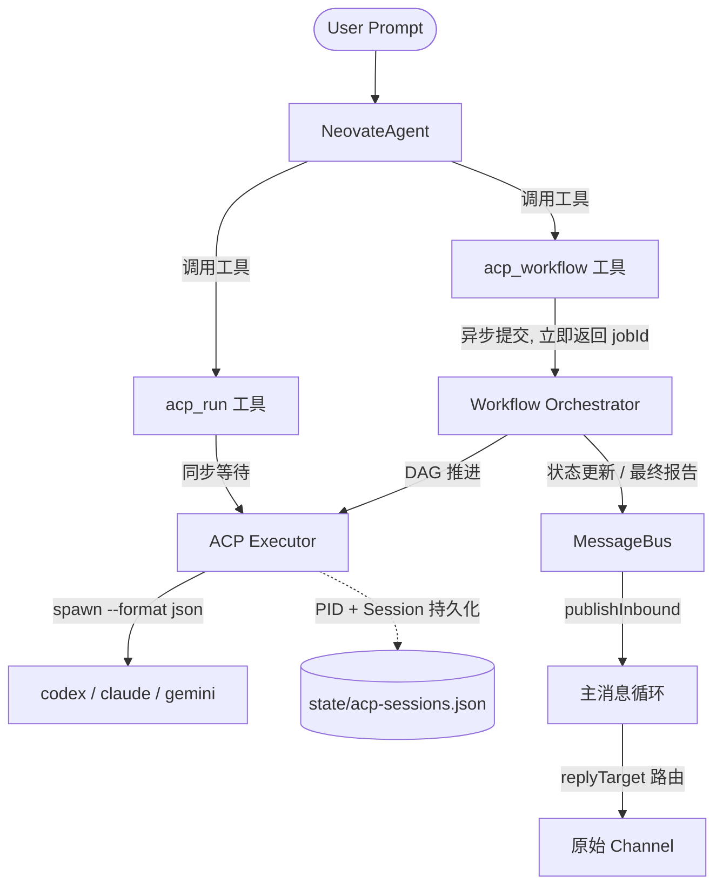

# Neoclaw ACP 多编程工具编排系统 — 技术设计 v2

日期：2026-03-10
版本：v2（可执行实施规格）
整合来源：Codex 初稿 · Claude Code 工程审阅 · Gemini 架构审阅 · 代码库实测对齐

---

## 1. 背景与动机

Neoclaw 现有 `code` 工具（`src/agent/tools/code.ts`）可启动单次编码会话，但存在三个瓶颈：

1. 单模型、单会话，无法表达"codex 做方案 → claude 审查 → gemini 开发"的多工具分工。
2. 缺少流程编排语义，无法强约束步骤顺序与依赖。
3. 长时任务会阻塞主 Agent 的 LLM API 调用，触发超时崩溃。

用户期望的交互方式：

> "帮我写一个网站，先让 codex 和 claude code 做方案，让 gemini-cli 开发。"

本设计将该需求拆解为一套可长期运行的 ACP（Agent Coding Pipeline）编排子系统。

---

## 2. 核心目标（v1.0 Scope）

| # | 目标 | 验收标准 |
|---|------|---------|
| G1 | 多工具统一接入 | codex / claude / gemini 均可通过统一 Executor 调度 |
| G2 | 强工作流编排 | 支持"提议→审查→实施→验证"串行 DAG |
| G3 | 长期运行稳定性 | 异步作业、PID 追踪、崩溃恢复 |
| G4 | 人机共驾 (HITL) | 断点挂起、用户介入、恢复执行 |
| G5 | 基础设施对齐 | 完全复用 createTool / MessageBus / RuntimeStatusStore |

## 3. 非目标

1. 不自研 ACP 协议或客户端，复用 `acpx` 作为执行网关。
2. 不替代 `code` 工具；`code` 继续作为轻量回退路径。
3. 不做无限自治执行；保持显式步骤与可审计边界。
4. 不引入远程控制平面，保持本地优先。

---

## 4. 总体架构

### 4.1 三层架构

```
┌─────────────────────────────────────────────────────┐
│                   接口聚合层                          │
│  acp_run (createTool)    acp_workflow (createTool)   │
└──────────────┬──────────────────┬────────────────────┘
               │                  │
┌──────────────▼──────────────────▼────────────────────┐
│              异步编排层 (WorkflowOrchestrator)         │
│  DAG 推进 · 状态机 · 工件交接 · MessageBus 通知        │
│  Suspend/Resume · 重试策略                            │
└──────────────┬──────────────────────────────────────┘
               │
┌──────────────▼──────────────────────────────────────┐
│              隔离执行层 (AcpExecutor)                  │
│  acpx spawn · NDJSON 解析 · PID 追踪 · 日志采集       │
│  CWD 安全限制 · 崩溃恢复 Reconciliation               │
└─────────────────────────────────────────────────────┘
```

### 4.2 系统交互图



---

## 5. 核心机制设计

### 5.1 异步作业机制（解决 LLM API 超时痛点）

代码生成和验证动辄 10~30 分钟，任何主流 LLM API 都会在几分钟内超时。因此 `acp_workflow` 必须设计为异步返回。

**流程：**

1. 主 Agent 调用 `acp_workflow` 工具。
2. Orchestrator 生成 `runId`，将工作流状态写入磁盘，启动后台执行。
3. 工具立即返回 `{ status: "started", jobId, message }` 给主 Agent，释放 LLM HTTP 连接。
4. 后续每个步骤完成或整体结束时，Orchestrator 通过 `MessageBus.publishInbound()` 发送系统消息，唤醒主 Agent 会话。

**MessageBus 回调格式（对齐 SubagentManager 模式）：**

```typescript
// 步骤完成通知
bus.publishInbound({
  channel: "system",
  senderId: `acp:${runId}`,
  chatId: `${originChannel}:${originChatId}`,
  content: `[ACP Workflow ${runId} step "${stepId}" completed]\nAgent: ${agent}\nDuration: ${durationMs}ms\nOutput: ${summaryPath}`,
  timestamp: new Date(),
  media: [],
  metadata: {
    acpRunId: runId,
    acpStepId: stepId,
    originChannel,
    originChatId,
  },
});

// 工作流最终完成通知
bus.publishInbound({
  channel: "system",
  senderId: `acp:${runId}`,
  chatId: `${originChannel}:${originChatId}`,
  content: `[ACP Workflow ${runId} finished]\nStatus: ${status}\nArtifacts: ${artifactDir}\n\nPlease summarize this result naturally for the user.`,
  timestamp: new Date(),
  media: [],
  metadata: {
    acpRunId: runId,
    originChannel,
    originChatId,
  },
});
```

> 注意：`chatId` 格式为 `"${originChannel}:${originChatId}"`，与 `replyTarget()` 函数（`src/bus/types.ts:26`）配合，确保回复路由到正确的用户会话。

### 5.2 崩溃恢复与进程追踪 (Reconciliation)

**问题：** Neoclaw 进程因 OOM、更新或断电重启后，底层 `acpx` 进程变成不受控的僵尸进程。

**持久化状态文件：** `{workspace}/state/acp-sessions.json`

```typescript
interface AcpSessionRecord {
  runId: string;
  stepId: string;
  agent: string;
  pid: number;
  sessionName: string;
  startedAt: string;
  status: "running" | "completed" | "failed";
}

// 文件格式
type AcpSessionsFile = {
  version: 1;
  sessions: AcpSessionRecord[];
};
```

**Reconciliation 流程（Neoclaw 启动时触发）：**

```
1. 读取 acp-sessions.json
2. 遍历 status === "running" 的记录
3. 检查 PID 是否存活（process.kill(pid, 0)）
   ├─ 存活 → 尝试 reattach（侦听 stdout），标记为 "recovering"
   └─ 不存活 → 标记为 "failed"，清理残留文件
4. 写回更新后的状态文件
5. 对 failed 的 run 通过 MessageBus 通知用户
```

### 5.3 工件交接契约 (Artifact Hand-off Contract)

**问题：** 全局工作区透传会导致下游 Agent 上下文爆炸，Token 窗口耗尽，严重降智。

**解决方案：** 每个步骤必须输出 manifest 文件，声明交接内容。

**Manifest 格式：** `{artifactDir}/{runId}/steps/{stepId}/manifest.json`

```typescript
interface StepManifest {
  stepId: string;
  agent: string;
  completedAt: string;
  // 传给下游的核心上下文（设计文档、规范等）
  coreOutputs: Array<{
    path: string;        // 相对于 artifactDir 的路径
    kind: "plan" | "spec" | "code" | "review";
    description: string; // 一句话描述，供 Orchestrator 构建下游 prompt
  }>;
  // 仅供人类审计的追踪日志（不传给下游）
  traceOutputs: Array<{
    path: string;
    kind: "log" | "raw-events" | "debug";
  }>;
  summary: string; // 本步骤的执行摘要（< 500 字）
};
```

**下游 Prompt 注入机制：**

Orchestrator 在启动下游步骤时，仅读取上游 manifest 的 `coreOutputs`，将文件内容拼接进下游 Agent 的 prompt：

```typescript
function buildDownstreamPrompt(task: string, upstreamManifests: StepManifest[]): string {
  const contextSections = upstreamManifests.flatMap(m =>
    m.coreOutputs.map(o => {
      const content = readFileSync(resolve(artifactDir, o.path), "utf-8");
      return `## [${m.stepId}] ${o.description}\n\`\`\`\n${content}\n\`\`\``;
    })
  );

  return [
    "# 任务目标",
    task,
    "",
    "# 上游交接上下文（只读，不可修改）",
    ...contextSections,
  ].join("\n");
}
```

### 5.4 人机共驾与断点挂起 (HITL & Suspend)

**问题：** Agent 陷入"改代码→报错→乱改"的死亡循环，消耗大量 Token 并破坏代码库。

**Suspend 状态触发条件：**

1. 同一步骤重试次数达到 `maxStepRetries`（默认 2）。
2. 遇到无法自动解决的错误类型（依赖冲突、权限拒绝、输入校验失败）。
3. 用户主动发送 `/acp pause <runId>` 命令。

**Suspend 流程：**

```
1. Orchestrator 将 run 状态变更为 suspended_waiting_for_user
2. 持久化当前 DAG 进度到磁盘
3. 通过 MessageBus 通知用户：
   "[ACP Workflow xxx suspended] 步骤 implement 在第 2 次重试后仍然失败。
    错误：Cannot resolve dependency '@foo/bar'
    请手动修复后发送 /acp resume xxx 继续执行。"
4. 用户修复问题后发送 /acp resume <runId>
5. Orchestrator 从磁盘恢复 DAG 状态，从失败步骤重新开始
```

---

## 6. 多 Agent 协同流：Proposer-Critic 模式

抛弃"多模型并行规划再融合"模式（合并时极易产生幻觉），改为串行对抗协作。

### 6.1 标准模板流程

```
┌──────────┐     ┌──────────┐     ┌──────────┐     ┌──────────┐
│  plan_   │     │  plan_   │     │implement │     │ validate │
│ propose  │────▶│ review   │────▶│          │────▶│          │
│ (codex)  │     │ (claude) │     │ (gemini) │     │ (local)  │
└──────────┘     └──────────┘     └──────────┘     └──────────┘
```

| 步骤 | 推荐 Agent | 权限 | 输入 | 输出 |
|------|-----------|------|------|------|
| `plan_propose` | codex | approve-reads | 原始需求 | 技术架构 + 目录骨架 |
| `plan_review` | claude | approve-reads | plan_propose 的 coreOutputs | 审查报告 + 修订后方案 |
| `implement` | gemini | approve-all | plan_review 的 coreOutputs | 代码实现 |
| `validate` | 本地执行器 | — | 用户定义的测试命令 | 验收报告 |

### 6.2 执行策略

1. 步骤严格串行，每步仅接收上游 manifest 中的 `coreOutputs`。
2. `implement` 步骤以只读模式接收设计文档，防止目标漂移。
3. `validate` 失败时允许一次自动修复回合（由 implement agent 重新执行），再次失败则 Suspend。
4. 每步超时独立配置，默认 `plan: 300s`、`implement: 600s`、`validate: 120s`。

### 6.3 DAG 定义格式

```typescript
interface WorkflowTemplate {
  id: string;                    // e.g. "proposer-critic-implement-validate"
  description: string;
  steps: WorkflowStepDef[];
}

interface WorkflowStepDef {
  id: string;                    // e.g. "plan_propose"
  agent: string;                 // "codex" | "claude" | "gemini" | "$local"
  dependsOn: string[];           // 上游步骤 ID 列表
  permission: "approve-reads" | "approve-all" | "deny-all";
  timeoutSec: number;
  maxRetries: number;
  promptTemplate: string;        // 支持 ${goal}、${upstream.plan_propose.summary} 等变量
  outputKinds: string[];         // 期望输出的 kind 列表，用于 manifest 校验
}
```

**内置默认模板（写死在代码中，P1 阶段不支持自定义）：**

```typescript
const DEFAULT_WORKFLOW: WorkflowTemplate = {
  id: "proposer-critic-implement-validate",
  description: "Proposer-Critic 串行对抗 + 实施 + 验证",
  steps: [
    {
      id: "plan_propose",
      agent: "codex",
      dependsOn: [],
      permission: "approve-reads",
      timeoutSec: 300,
      maxRetries: 1,
      promptTemplate: "请为以下需求生成完整的技术架构设计和目录骨架：\n\n${goal}\n\n要求：输出 markdown 格式的设计文档。",
      outputKinds: ["plan"],
    },
    {
      id: "plan_review",
      agent: "claude",
      dependsOn: ["plan_propose"],
      permission: "approve-reads",
      timeoutSec: 300,
      maxRetries: 1,
      promptTemplate: "请审查以下技术方案，指出安全性、边界异常与架构合理性问题，并输出修订后的最终方案：\n\n${upstream.plan_propose}\n\n原始需求：${goal}",
      outputKinds: ["spec"],
    },
    {
      id: "implement",
      agent: "gemini",
      dependsOn: ["plan_review"],
      permission: "approve-all",
      timeoutSec: 600,
      maxRetries: 2,
      promptTemplate: "请严格按照以下技术规范实现代码，不要偏离设计：\n\n${upstream.plan_review}\n\n只实现代码，不要修改设计文档。",
      outputKinds: ["code"],
    },
    {
      id: "validate",
      agent: "$local",
      dependsOn: ["implement"],
      permission: "deny-all",
      timeoutSec: 120,
      maxRetries: 0,
      promptTemplate: "",
      outputKinds: ["validation-report"],
    },
  ],
};
```

---

## 7. 完整数据模型

### 7.1 执行请求

```typescript
/** acp_run 单步执行请求 */
interface AcpRunRequest {
  agent: "codex" | "claude" | "gemini" | string;
  prompt: string;
  cwd: string;
  mode: "exec" | "session";
  sessionName?: string;
  timeoutSec?: number;
  permission?: "approve-all" | "approve-reads" | "deny-all";
  outputPath?: string;  // 指定结果工件写入路径
}

/** acp_run 执行结果 */
interface AcpRunResult {
  runId: string;
  agent: string;
  status: "succeeded" | "failed" | "timed_out" | "cancelled";
  durationMs: number;
  output: string;       // 最终文本结果
  logPath: string;      // 完整日志路径
  error?: string;
}
```

### 7.2 工作流请求与记录

```typescript
/** acp_workflow 工作流请求 */
interface AcpWorkflowRequest {
  goal: string;
  workflowTemplate: string;  // 模板 ID，默认 "proposer-critic-implement-validate"
  planAgent?: string;         // 覆盖规划 agent，默认 "codex"
  reviewAgent?: string;       // 覆盖审查 agent，默认 "claude"
  implementAgent?: string;    // 覆盖实施 agent，默认 "gemini"
  cwd: string;
  constraints?: string;       // 技术栈、交付格式、禁止项
  acceptance?: string[];      // 验收命令列表，如 ["bun test", "bun run build"]
}

/** 工作流运行记录（持久化到磁盘） */
interface WorkflowRunRecord {
  runId: string;
  channel: string;
  chatId: string;
  goal: string;
  templateId: string;
  requestedAt: string;
  startedAt?: string;
  finishedAt?: string;
  status: WorkflowStatus;
  steps: WorkflowStepRecord[];
  artifacts: WorkflowArtifact[];
}

type WorkflowStatus =
  | "pending"
  | "running"
  | "succeeded"
  | "failed"
  | "cancelled"
  | "suspended_waiting_for_user";
```

### 7.3 步骤状态机

```typescript
interface WorkflowStepRecord {
  id: string;
  agent: string;
  status: StepStatus;
  attempts: number;
  startedAt?: string;
  finishedAt?: string;
  error?: string;
  manifestPath?: string;  // 指向 manifest.json
}

type StepStatus =
  | "pending"
  | "running"
  | "succeeded"
  | "failed"
  | "retrying"
  | "cancelled"
  | "timed_out"
  | "skipped"
  | "suspended";
```

**状态流转图：**

```
pending ──▶ running ──▶ succeeded
               │
               ├──▶ failed ──▶ retrying ──▶ running
               │                    │
               │                    └──▶ suspended (达到 maxRetries)
               │
               ├──▶ timed_out ──▶ retrying ──▶ running
               │
               ├──▶ cancelled
               │
               └──▶ skipped (上游失败且无降级策略)
```

### 7.4 工件模型

```typescript
interface WorkflowArtifact {
  id: string;
  stepId: string;
  kind: "plan" | "spec" | "code" | "review" | "validation-report" | "log" | "raw-events";
  path: string;          // 相对于 artifactDir
  createdAt: string;
  summary?: string;
}
```

---

## 8. 模块设计与文件路径

### 8.1 目录结构

```
src/services/acp/
  ├── executor.ts          # AcpExecutor：acpx 进程管理、NDJSON 解析
  ├── parser.ts            # NDJSON 事件流解析器
  ├── errors.ts            # 错误分类与映射
  ├── session-router.ts    # 会话命名、映射、生命周期
  ├── orchestrator.ts      # WorkflowOrchestrator：DAG 推进、状态机
  ├── reconciler.ts        # 启动时僵尸进程巡检与恢复
  ├── artifact.ts          # 工件管理、manifest 读写
  └── types.ts             # 所有 ACP 相关类型定义

src/agent/tools/
  ├── acp-run.ts           # acp_run 工具定义
  └── acp-workflow.ts      # acp_workflow 工具定义
```

### 8.2 AcpExecutor（`src/services/acp/executor.ts`）

职责：以参数化方式调用 `acpx`，解析事件流，返回结构化结果。

```typescript
import { spawn, type ChildProcess } from "child_process";

interface ExecutorOptions {
  command: string;         // 默认 "acpx"
  workspace: string;
  allowedBaseDir: string;  // CWD 安全边界
}

class AcpExecutor {
  private processes = new Map<string, ChildProcess>();

  constructor(private opts: ExecutorOptions) {}

  /**
   * 启动一次 acpx 执行，返回结构化结果。
   * 关键：使用参数数组调用，禁止 shell 拼接注入。
   */
  async execute(request: AcpRunRequest): Promise<AcpRunResult> {
    this.validateCwd(request.cwd);
    const runId = crypto.randomUUID().slice(0, 12);
    const args = this.buildArgs(request);

    const child = spawn(this.opts.command, args, {
      cwd: request.cwd,
      stdio: ["pipe", "pipe", "pipe"],
      env: { ...process.env },
    });

    this.processes.set(runId, child);
    // ... PID 持久化、NDJSON 解析、超时控制、结果聚合
  }

  /** 构建 acpx 命令参数（纯数组，无 shell 拼接） */
  private buildArgs(request: AcpRunRequest): string[] {
    const args = [request.agent];

    if (request.mode === "session") {
      args.push("session", "send");
      if (request.sessionName) args.push("-s", request.sessionName);
    } else {
      args.push("exec");
    }

    args.push("--format", "json");

    if (request.permission) {
      args.push("--permission", request.permission);
    }

    args.push(request.prompt);
    return args;
  }

  /** CWD 安全校验：必须在允许的根目录内 */
  private validateCwd(cwd: string): void {
    const resolved = resolve(cwd);
    const base = resolve(this.opts.allowedBaseDir);
    if (!resolved.startsWith(base)) {
      throw new AcpError("CWD_OUT_OF_BOUNDS", `${cwd} is outside allowed directory ${base}`);
    }
  }

  /** 取消执行 */
  async cancel(runId: string): Promise<void> {
    const child = this.processes.get(runId);
    if (child && !child.killed) {
      child.kill("SIGTERM");
      // 等待窗口后强制 SIGKILL
      setTimeout(() => { if (!child.killed) child.kill("SIGKILL"); }, 5000);
    }
  }
}
```

### 8.3 NDJSON 事件解析器（`src/services/acp/parser.ts`）

```typescript
/** acpx --format json 输出的事件类型 */
interface AcpEvent {
  type: "start" | "progress" | "tool_use" | "result" | "error" | "done";
  timestamp: string;
  data: Record<string, unknown>;
}

/**
 * 从 acpx 子进程的 stdout 逐行解析 NDJSON 事件。
 * 非 JSON 行静默跳过（acpx 可能输出启动 banner）。
 */
async function* parseNdjsonStream(stream: NodeJS.ReadableStream): AsyncGenerator<AcpEvent> {
  let buffer = "";
  for await (const chunk of stream) {
    buffer += chunk.toString();
    const lines = buffer.split("\n");
    buffer = lines.pop() ?? "";
    for (const line of lines) {
      const trimmed = line.trim();
      if (!trimmed) continue;
      try {
        yield JSON.parse(trimmed) as AcpEvent;
      } catch {
        // 非 JSON 行，跳过（可能是 acpx 启动信息）
      }
    }
  }
  // 处理最后一行
  if (buffer.trim()) {
    try { yield JSON.parse(buffer.trim()) as AcpEvent; } catch {}
  }
}
```

### 8.4 错误分类（`src/services/acp/errors.ts`）

```typescript
type AcpErrorCode =
  | "CONFIG_ERROR"        // acpx 未安装、agent 不在 allow-list
  | "CWD_OUT_OF_BOUNDS"   // cwd 越界
  | "PERMISSION_DENIED"   // 权限拒绝
  | "SPAWN_FAILED"        // 进程启动失败
  | "SESSION_LOST"        // 会话丢失
  | "PARSE_ERROR"         // NDJSON 解析失败
  | "TIMEOUT"             // 执行超时
  | "AGENT_ERROR"         // Agent 内部业务错误（测试失败等）
  | "CANCELLED";          // 用户取消

class AcpError extends Error {
  constructor(
    public code: AcpErrorCode,
    message: string,
    public retryable: boolean = false,
  ) {
    super(message);
    this.name = "AcpError";
  }
}

/** 根据错误码判断是否可重试 */
function isRetryable(code: AcpErrorCode): boolean {
  return ["SESSION_LOST", "SPAWN_FAILED", "TIMEOUT"].includes(code);
}
```

### 8.5 会话路由（`src/services/acp/session-router.ts`）

```typescript
import { createHash } from "crypto";

/**
 * 生成 acpx session 名称。
 * 格式：neoclaw::<channel>::<chatIdHash>::<runId>::<stepId>::<agent>
 * 同一 run 的同一步骤重试复用同名 session。
 */
function buildSessionName(
  channel: string,
  chatId: string,
  runId: string,
  stepId: string,
  agent: string,
): string {
  const chatHash = createHash("sha256").update(chatId).digest("hex").slice(0, 8);
  return `neoclaw::${channel}::${chatHash}::${runId}::${stepId}::${agent}`;
}

class AcpSessionRouter {
  /**
   * 确保 session 存在。如果 autoEnsureSession=true，
   * 在执行前自动调用 acpx <agent> sessions ensure -s <name>
   */
  async ensureSession(name: string, agent: string): Promise<void> { /* ... */ }

  /** 关闭 session */
  async closeSession(name: string, agent: string): Promise<void> { /* ... */ }

  /** 查询 session 状态 */
  async getSessionStatus(name: string, agent: string): Promise<"active" | "idle" | "not_found"> { /* ... */ }

  /** 取消 session 中正在执行的任务 */
  async cancelSession(name: string, agent: string): Promise<void> { /* ... */ }
}
```

### 8.6 WorkflowOrchestrator（`src/services/acp/orchestrator.ts`）

```typescript
class WorkflowOrchestrator {
  constructor(
    private executor: AcpExecutor,
    private sessionRouter: AcpSessionRouter,
    private bus: MessageBus,
    private config: AcpConfig,
    private statusStore?: RuntimeStatusStore,
  ) {}

  /**
   * 提交工作流（异步）。立即返回 runId，后台执行。
   */
  async submit(
    request: AcpWorkflowRequest,
    originChannel: string,
    originChatId: string,
  ): Promise<string> {
    const runId = crypto.randomUUID().slice(0, 12);
    const record = this.initRunRecord(runId, request, originChannel, originChatId);
    await this.persistRunRecord(record);

    // 后台执行，不阻塞
    this.runWorkflow(record).catch(err => {
      this.handleFatalError(record, err);
    });

    return runId;
  }

  /** DAG 推进主循环 */
  private async runWorkflow(record: WorkflowRunRecord): Promise<void> {
    record.status = "running";
    record.startedAt = new Date().toISOString();
    await this.persistRunRecord(record);

    const template = this.resolveTemplate(record.templateId);

    for (const stepDef of template.steps) {
      // 检查是否被取消或挂起
      if (record.status === "cancelled" || record.status === "suspended_waiting_for_user") break;

      // 检查依赖是否全部完成
      const depsOk = stepDef.dependsOn.every(depId => {
        const dep = record.steps.find(s => s.id === depId);
        return dep?.status === "succeeded";
      });
      if (!depsOk) {
        this.markStepSkipped(record, stepDef.id);
        continue;
      }

      await this.executeStep(record, stepDef);
    }

    // 最终状态判定
    if (record.status === "running") {
      const allSucceeded = record.steps.every(s => s.status === "succeeded");
      record.status = allSucceeded ? "succeeded" : "failed";
    }
    record.finishedAt = new Date().toISOString();
    await this.persistRunRecord(record);
    this.notifyCompletion(record);
  }

  /** 执行单个步骤（含重试） */
  private async executeStep(record: WorkflowRunRecord, stepDef: WorkflowStepDef): Promise<void> {
    const stepRecord = this.initStepRecord(stepDef);
    record.steps.push(stepRecord);

    for (let attempt = 0; attempt <= stepDef.maxRetries; attempt++) {
      stepRecord.attempts = attempt + 1;
      stepRecord.status = attempt === 0 ? "running" : "retrying";
      stepRecord.startedAt = new Date().toISOString();
      await this.persistRunRecord(record);

      try {
        if (stepDef.agent === "$local") {
          await this.executeLocalValidation(record, stepDef, stepRecord);
        } else {
          await this.executeAgentStep(record, stepDef, stepRecord);
        }
        stepRecord.status = "succeeded";
        stepRecord.finishedAt = new Date().toISOString();
        this.notifyStepComplete(record, stepRecord);
        return;
      } catch (err) {
        const acpErr = err instanceof AcpError ? err : new AcpError("AGENT_ERROR", String(err));
        stepRecord.error = acpErr.message;

        if (!isRetryable(acpErr.code) || attempt >= stepDef.maxRetries) {
          stepRecord.status = "suspended";
          record.status = "suspended_waiting_for_user";
          await this.persistRunRecord(record);
          this.notifySuspend(record, stepRecord, acpErr);
          return;
        }

        // 指数退避重试
        const backoff = this.config.retryBackoffMs * Math.pow(2, attempt);
        await new Promise(r => setTimeout(r, backoff));
      }
    }
  }

  /** 恢复挂起的工作流 */
  async resume(runId: string): Promise<boolean> {
    const record = await this.loadRunRecord(runId);
    if (!record || record.status !== "suspended_waiting_for_user") return false;

    // 找到挂起的步骤，重置状态
    const suspendedStep = record.steps.find(s => s.status === "suspended");
    if (suspendedStep) {
      suspendedStep.status = "pending";
      suspendedStep.error = undefined;
      suspendedStep.attempts = 0;
    }
    record.status = "running";
    await this.persistRunRecord(record);

    this.runWorkflow(record).catch(err => this.handleFatalError(record, err));
    return true;
  }

  /** 取消工作流 */
  async cancel(runId: string): Promise<boolean> {
    const record = await this.loadRunRecord(runId);
    if (!record || record.status === "succeeded" || record.status === "failed") return false;

    record.status = "cancelled";
    record.finishedAt = new Date().toISOString();
    await this.persistRunRecord(record);

    // 取消正在运行的步骤
    const runningStep = record.steps.find(s => s.status === "running");
    if (runningStep) {
      await this.executor.cancel(`${runId}:${runningStep.id}`);
    }
    return true;
  }

  /** 持久化运行记录到磁盘 */
  private async persistRunRecord(record: WorkflowRunRecord): Promise<void> {
    const dir = join(this.config.artifactDir, record.runId);
    mkdirSync(dir, { recursive: true });
    writeFileSync(join(dir, "run.json"), JSON.stringify(record, null, 2), "utf-8");
  }
}
```

---

## 9. 工具接口设计（Zod Schema）

### 9.1 `acp_run`（`src/agent/tools/acp-run.ts`）

单步执行工具，同步等待结果（设置合理超时）。

```typescript
import { createTool, _zod as z } from "@neovate/code";
import type { Config } from "../../config/schema.js";
import type { AcpExecutor } from "../../services/acp/executor.js";

export function createAcpRunTool(opts: {
  config: Config;
  executor: AcpExecutor;
}): ReturnType<typeof createTool> {
  const { config, executor } = opts;

  return createTool({
    name: "acp_run",
    description:
      "Execute a coding task using a specific AI coding agent (codex/claude/gemini). " +
      "Spawns the agent via acpx, waits for completion, and returns the result. " +
      "For complex multi-step workflows, use acp_workflow instead.",
    parameters: z.object({
      task: z.string().describe("The coding task prompt to execute"),
      agent: z
        .enum(["codex", "claude", "gemini"])
        .describe("Which AI coding agent to use"),
      cwd: z.string().describe("Absolute path to the working directory"),
      permission: z
        .enum(["approve-reads", "approve-all", "deny-all"])
        .optional()
        .describe("Permission level. Defaults to approve-reads"),
      timeout_sec: z
        .number()
        .optional()
        .describe("Timeout in seconds. Defaults to config value"),
      output_path: z
        .string()
        .optional()
        .describe("Optional path to write the result artifact"),
    }),
    async execute(params) {
      // 校验 agent 是否在 allow-list
      const acpConfig = config.acp;
      if (!acpConfig?.enabled) {
        return { llmContent: "Error: ACP is not enabled in configuration.", isError: true };
      }
      if (!acpConfig.allowedAgents.includes(params.agent)) {
        return {
          llmContent: `Error: agent "${params.agent}" is not in the allowed list: [${acpConfig.allowedAgents.join(", ")}]`,
          isError: true,
        };
      }

      try {
        const result = await executor.execute({
          agent: params.agent,
          prompt: params.task,
          cwd: params.cwd,
          mode: "exec",
          permission: params.permission ?? acpConfig.defaultPermission,
          timeoutSec: params.timeout_sec ?? acpConfig.timeoutSec,
          outputPath: params.output_path,
        });

        return {
          llmContent: [
            `Agent: ${result.agent}`,
            `Status: ${result.status}`,
            `Duration: ${result.durationMs}ms`,
            `Log: ${result.logPath}`,
            "",
            result.output,
          ].join("\n"),
          isError: result.status !== "succeeded",
        };
      } catch (err) {
        const msg = err instanceof Error ? err.message : String(err);
        return { llmContent: `Error executing acp_run: ${msg}`, isError: true };
      }
    },
  });
}
```

### 9.2 `acp_workflow`（`src/agent/tools/acp-workflow.ts`）

多步骤编排工具，异步返回 jobId。

```typescript
export function createAcpWorkflowTool(opts: {
  config: Config;
  orchestrator: WorkflowOrchestrator;
  channel: string;
  chatId: string;
}): ReturnType<typeof createTool> {
  const { config, orchestrator, channel, chatId } = opts;

  return createTool({
    name: "acp_workflow",
    description:
      "Launch a multi-agent coding workflow (plan → review → implement → validate). " +
      "Returns immediately with a job ID. Progress and results are delivered via system messages. " +
      "Use this for complex tasks that require multiple AI agents collaborating.",
    parameters: z.object({
      goal: z.string().describe("The overall project goal in natural language"),
      plan_agent: z
        .enum(["codex", "claude", "gemini"])
        .optional()
        .describe("Agent for the planning step. Defaults to codex"),
      review_agent: z
        .enum(["codex", "claude", "gemini"])
        .optional()
        .describe("Agent for the review step. Defaults to claude"),
      implement_agent: z
        .enum(["codex", "claude", "gemini"])
        .optional()
        .describe("Agent for the implementation step. Defaults to gemini"),
      cwd: z.string().describe("Absolute path to the working directory"),
      constraints: z
        .string()
        .optional()
        .describe("Technical constraints: stack, format, restrictions"),
      acceptance: z
        .array(z.string())
        .optional()
        .describe("Validation commands to run, e.g. ['bun test', 'bun run build']"),
    }),
    async execute(params) {
      const acpConfig = config.acp;
      if (!acpConfig?.enabled) {
        return { llmContent: "Error: ACP is not enabled in configuration.", isError: true };
      }

      try {
        const jobId = await orchestrator.submit(
          {
            goal: params.goal,
            workflowTemplate: "proposer-critic-implement-validate",
            planAgent: params.plan_agent,
            reviewAgent: params.review_agent,
            implementAgent: params.implement_agent,
            cwd: params.cwd,
            constraints: params.constraints,
            acceptance: params.acceptance,
          },
          channel,
          chatId,
        );

        return {
          llmContent: [
            `工作流已在后台启动。`,
            `Job ID: ${jobId}`,
            `流程：${params.plan_agent ?? "codex"} 规划 → ${params.review_agent ?? "claude"} 审查 → ${params.implement_agent ?? "gemini"} 实施 → 验证`,
            `每个步骤完成后会通过消息通知你。`,
          ].join("\n"),
        };
      } catch (err) {
        const msg = err instanceof Error ? err.message : String(err);
        return { llmContent: `Error launching workflow: ${msg}`, isError: true };
      }
    },
  });
}
```

---

## 10. 配置设计

### 10.1 Config 接口扩展

ACP 配置放在顶层，与 `agent` / `channels` 齐平（ACP 是独立子系统，不属于 agent 内部）。

```typescript
// src/config/schema.ts 扩展

export interface AcpConfig {
  enabled: boolean;
  command: string;                    // acpx 可执行路径，默认 "acpx"
  defaultAgent: "codex" | "claude" | "gemini";
  allowedAgents: string[];            // allow-list
  defaultPermission: "approve-reads" | "approve-all" | "deny-all";
  timeoutSec: number;                 // 单步默认超时，默认 300
  maxParallelRuns: number;            // 全局最大并发工作流数，默认 2
  maxStepRetries: number;             // 步骤最大重试次数，默认 2
  retryBackoffMs: number;             // 重试退避基数，默认 3000
  autoEnsureSession: boolean;         // 自动创建 session，默认 true
  fallbackToCodeTool: boolean;        // ACP 不可用时回退 code 工具，默认 true
  artifactDir: string;                // 默认 "{workspace}/artifacts/acp-runs"
  logDir: string;                     // 默认 "{workspace}/logs/acp"
  stateDir: string;                   // 默认 "{workspace}/state"
  agentCommandOverrides?: Record<string, string>;  // 按 agent 覆盖命令路径
}

// Config 顶层扩展
export interface Config {
  agent: AgentConfig;
  channels: ChannelsConfig;
  providers?: Record<string, ProviderConfig>;
  logLevel?: string;
  acp?: AcpConfig;                    // 新增，可选
}
```

### 10.2 默认值

```typescript
// defaultConfig 中新增
acp: {
  enabled: false,
  command: "acpx",
  defaultAgent: "codex",
  allowedAgents: ["codex", "claude", "gemini"],
  defaultPermission: "approve-reads",
  timeoutSec: 300,
  maxParallelRuns: 2,
  maxStepRetries: 2,
  retryBackoffMs: 3000,
  autoEnsureSession: true,
  fallbackToCodeTool: true,
  artifactDir: join(workspace, "artifacts", "acp-runs"),
  logDir: join(workspace, "logs", "acp"),
  stateDir: join(workspace, "state"),
},
```

### 10.3 默认值原则

1. 安全优先：`defaultPermission = "approve-reads"`，写操作需显式声明。
2. 稳定优先：`autoEnsureSession = true`，减少会话丢失。
3. 可恢复优先：`fallbackToCodeTool = true`，ACP 不可用时不中断服务。

### 10.4 loadConfig 兼容性

新增字段全部可选，缺省回落默认值。老配置文件无需修改即可升级：

```typescript
// loadConfig 中新增合并逻辑
config.acp = {
  ...defaults.acp,
  ...raw.acp,
};
```

---

## 11. 与 Neoclaw 现有体系的整合

### 11.1 工具注册（`src/agent/neovate-agent.ts`）

在 `ensureSession()` 的工具数组中注入 ACP 工具：

```typescript
// neovate-agent.ts ensureSession() 中新增
const tools = [
  cronTool, sendFileTool, codeTool, spawnTool,
  memorySearchTool, memoryGetTool,
];

// 仅在 ACP 启用时注入
if (this.config.acp?.enabled) {
  const acpRunTool = createAcpRunTool({ config: this.config, executor: this.acpExecutor });
  const acpWorkflowTool = createAcpWorkflowTool({
    config: this.config,
    orchestrator: this.acpOrchestrator,
    channel: msg.channel,
    chatId: msg.chatId,
  });
  tools.push(acpRunTool, acpWorkflowTool);
}
```

### 11.2 服务初始化（`src/index.ts`）

```typescript
// ACP 服务初始化（在 agent 创建之前）
let acpExecutor: AcpExecutor | undefined;
let acpOrchestrator: WorkflowOrchestrator | undefined;

if (config.acp?.enabled) {
  // 确保目录存在
  ensureAcpDirs(config.acp);

  acpExecutor = new AcpExecutor({
    command: config.acp.command,
    workspace: config.agent.workspace,
    allowedBaseDir: config.agent.workspace,
  });

  acpOrchestrator = new WorkflowOrchestrator(
    acpExecutor,
    new AcpSessionRouter(config.acp),
    bus,
    config.acp,
    statusStore,
  );

  // 启动时执行 Reconciliation
  const reconciler = new AcpReconciler(acpExecutor, config.acp, bus);
  await reconciler.reconcile();
}
```

### 11.3 ensureWorkspaceDirs 扩展

```typescript
// src/config/schema.ts
export function ensureWorkspaceDirs(workspace: string): void {
  const dirs = [
    workspace,
    join(workspace, "skills"),
    join(workspace, "memory"),
    join(workspace, "logs"),
  ];
  for (const d of dirs) mkdirSync(d, { recursive: true });
}

// 新增 ACP 专用目录初始化
export function ensureAcpDirs(acpConfig: AcpConfig): void {
  const dirs = [
    acpConfig.artifactDir,
    acpConfig.logDir,
    acpConfig.stateDir,
  ];
  for (const d of dirs) mkdirSync(d, { recursive: true });
}
```

### 11.4 与 SubagentManager 的职能划分

| 维度 | SubagentManager | ACP Orchestrator |
|------|----------------|-----------------|
| 交互模式 | 会话内交互式子节点 | 非交互式后台流水线 |
| 执行时长 | 秒~分钟级 | 分钟~小时级 |
| 工具后端 | @neovate/code SDK | acpx (codex/claude/gemini) |
| 状态持久化 | 无（内存） | 有（磁盘 JSON） |
| 崩溃恢复 | 无 | Reconciliation |
| 适用场景 | 碎片化代码研究 | 完整研发管线 |

两者共存，互不替代。

---

## 12. 会话管理与并发控制

### 12.1 会话命名规则

```
neoclaw::<channel>::<chatIdHash8>::<runId>::<stepId>::<agent>
```

- 超长字段 SHA-256 截断前 8 位。
- 同一 run 的同一步骤重试复用同名 session，避免 session 泄漏。
- run 结束后按策略 close 或保留（默认 close）。

### 12.2 并发控制

1. 全局并发：`maxParallelRuns` 限制同时运行的工作流数量。
2. 单会话串行：同一个 session 只允许一个 running step。
3. 工作流内串行：Proposer-Critic 模式下步骤严格串行。

### 12.3 取消机制

```
用户 /acp cancel <runId>
  │
  ▼
Orchestrator.cancel(runId)
  │
  ├─ 标记 record.status = "cancelled"
  ├─ 找到 running step
  │    ├─ acpx <agent> cancel -s <session>  (cooperative)
  │    └─ 5s 后 SIGKILL (force)
  └─ 通过 MessageBus 通知用户
```

---

## 13. 错误处理与容错

### 13.1 错误分类与处理策略

| 错误类型 | 示例 | 可重试 | 处理方式 |
|---------|------|--------|---------|
| 配置错误 | acpx 未安装、agent 不在 allow-list | 否 | 立即返回错误 |
| CWD 越界 | cwd 超出 workspace 范围 | 否 | 立即返回错误 |
| 权限拒绝 | permission denied | 否 | 立即返回错误 |
| 进程启动失败 | acpx spawn 失败 | 是 | 指数退避重试 |
| 会话丢失 | session 被外部清理 | 是 | 重建 session 后重试 |
| 执行超时 | 步骤超过 timeoutSec | 是 | 重试一次，再超时则 Suspend |
| 业务错误 | 测试失败、构建失败 | 否 | 直接 Suspend，等待用户介入 |

### 13.2 重试策略

```typescript
// 指数退避：retryBackoffMs * 2^attempt，上限 30s
const backoff = Math.min(
  config.retryBackoffMs * Math.pow(2, attempt),
  30_000,
);
```

- 仅对 `retryable = true` 的错误重试。
- 权限拒绝和输入校验错误永不重试。
- 达到 `maxStepRetries` 后转入 Suspend。

### 13.3 降级策略

当 ACP 执行层不可用（acpx 未安装或版本不兼容）且 `fallbackToCodeTool = true` 时：

1. `acp_run` 自动回退到现有 `code` 工具执行。
2. `acp_workflow` 返回错误提示，建议用户手动使用 `code` 工具分步执行。
3. 降级时在返回结果中显式标记 `[DEGRADED: using code tool fallback]`。

---

## 14. 安全设计

### 14.1 命令执行安全

1. 仅使用 `spawn()` 参数数组调用进程，禁止 `shell: true`，防止命令注入。
2. `cwd` 必须通过 `path.resolve()` 规范化并校验在 `allowedBaseDir` 内。
3. 禁止用户直接覆盖 `command` 可执行路径，除非通过 `agentCommandOverrides` 配置。

### 14.2 敏感信息处理

1. 事件日志写盘前做敏感字段脱敏（正则匹配 token、secret、apiKey、password）。
2. Web API 返回日志摘要，不返回原始完整凭据。
3. `acp-sessions.json` 不存储任何 prompt 内容，仅存储 PID 和元数据。

### 14.3 权限最小化

1. 默认 `approve-reads`，所有写操作需在工作流步骤定义中显式声明 `approve-all`。
2. `validate` 步骤固定 `deny-all`，仅运行用户指定的测试命令。

---

## 15. 可观测性与审计

### 15.1 目录结构

```
{workspace}/
  artifacts/acp-runs/
    {runId}/
      run.json                          # WorkflowRunRecord
      steps/
        plan_propose/
          manifest.json                 # StepManifest
          output.md                     # 核心输出
          trace.ndjson                  # 原始事件流
        plan_review/
          manifest.json
          output.md
          trace.ndjson
        implement/
          manifest.json
          trace.ndjson
        validate/
          manifest.json
          report.txt
  logs/acp/
    {runId}.log                         # 聚合日志（人类可读）
  state/
    acp-sessions.json                   # PID 追踪
```

### 15.2 RuntimeStatusStore 扩展指标

在现有 `RuntimeStatusStore` 中新增 ACP 相关指标：

```typescript
// 扩展 RuntimeStatusSnapshot
interface RuntimeStatusSnapshot {
  // ... 现有字段 ...
  acp?: {
    enabled: boolean;
    activeRuns: number;
    totalRuns: number;
    totalSucceeded: number;
    totalFailed: number;
    totalCancelled: number;
    lastRunAt?: string;
    lastError?: string;
  };
}
```

### 15.3 最终报告规范

每个工作流完成后生成的报告固定包含：

1. 目标与最终结果（succeeded / failed / cancelled）
2. 步骤执行摘要（每步 agent、耗时、状态、重试次数）
3. 关键工件路径列表
4. 风险与未完成项
5. 是否发生重试 / 降级 / Suspend

---

## 16. Web API 端点

### 16.1 新增 REST API

```typescript
// src/commands/web.ts 中新增路由

// 健康检查：检测 acpx 与各 agent 可用性
GET  /api/acp/health
Response: {
  acpxInstalled: boolean;
  acpxVersion?: string;
  agents: Record<string, { available: boolean; version?: string; error?: string }>;
}

// 查询工作流运行列表
GET  /api/acp/runs?limit=20&status=running
Response: {
  runs: Array<{
    runId: string;
    goal: string;
    status: WorkflowStatus;
    startedAt?: string;
    finishedAt?: string;
    currentStep?: string;
  }>;
}

// 查询单个工作流详情
GET  /api/acp/runs/:id
Response: WorkflowRunRecord  // 完整记录，含所有步骤和工件

// 取消工作流
POST /api/acp/runs/:id/cancel
Response: { success: boolean; message: string }

// 恢复挂起的工作流
POST /api/acp/runs/:id/resume
Response: { success: boolean; message: string }
```

### 16.2 Web 管理面板扩展

在现有 Config 页面新增 ACP 配置区块：

1. 启用开关与默认 Agent 选择
2. 权限策略、超时、并发限制
3. Agent command override（高级折叠区）
4. "ACP 健康检查"按钮（调用 `/api/acp/health`）

新增 ACP Runs 页面（P2 阶段）：

1. 工作流列表视图（状态筛选、时间排序）
2. 单个工作流详情（步骤时间线、日志查看）
3. 操作按钮：Cancel / Resume

---

## 17. 用户命令接口

通过 Agent 自然语言理解自动路由到 ACP 工具，同时支持显式命令：

```
/acp status              # 查看当前活跃的工作流
/acp runs                # 列出最近的工作流
/acp cancel <runId>      # 取消工作流
/acp pause <runId>       # 手动挂起工作流
/acp resume <runId>      # 恢复挂起的工作流
/acp health              # 检查 acpx 和 agent 可用性
```

这些命令通过 Skill 机制实现（`{workspace}/skills/acp/SKILL.md`），内部转化为对应的工具调用或 API 请求。

---

## 18. 测试策略

### 18.1 单元测试

| 模块 | 测试重点 |
|------|---------|
| `executor.ts` | 命令参数构建、CWD 安全校验、路径越界保护 |
| `parser.ts` | NDJSON 解析、非 JSON 行跳过、流中断处理 |
| `errors.ts` | 错误分类、retryable 判定 |
| `session-router.ts` | session 名称生成、hash 截断 |
| `orchestrator.ts` | 状态机流转、重试行为、Suspend 触发 |
| `artifact.ts` | manifest 读写、coreOutputs 过滤 |

### 18.2 集成测试

用 mock acpx 进程（shell 脚本模拟）覆盖：

1. 正常执行 → succeeded
2. 执行失败 → failed → retry → succeeded
3. 超时 → timed_out → retry → suspended
4. 用户取消 → cancelled
5. 串行工作流完整流程（plan → review → implement → validate）
6. session ensure 与恢复逻辑
7. Reconciliation：模拟进程残留后重启

### 18.3 端到端测试

1. 真机环境跑一次完整的"codex 规划 → claude 审查 → gemini 实施"流程。
2. 注入失败场景（一个 agent 失败、测试失败再修复）。
3. 验证最终工件、日志、报告三者一致。
4. 验证 MessageBus 通知正确路由到原始 channel。

---

## 19. 分期实施路线图

### P0 阶段：基础执行面（v1-beta）

目标：打通单模型、稳定健壮的命令行调度。

| 任务 | 文件 | 说明 |
|------|------|------|
| 定义 ACP 类型 | `src/services/acp/types.ts` | 所有 interface / type |
| 实现 AcpExecutor | `src/services/acp/executor.ts` | acpx spawn + PID 追踪 |
| 实现 NDJSON 解析器 | `src/services/acp/parser.ts` | 事件流解析 |
| 实现错误分类 | `src/services/acp/errors.ts` | AcpError + isRetryable |
| 实现 acp_run 工具 | `src/agent/tools/acp-run.ts` | createTool 注册 |
| 扩展 Config | `src/config/schema.ts` | AcpConfig + 默认值 |
| 扩展 ensureWorkspaceDirs | `src/config/schema.ts` | ACP 目录创建 |
| 注入工具到 Agent | `src/agent/neovate-agent.ts` | ensureSession 扩展 |
| 单元测试 | `src/services/acp/__tests__/` | executor + parser + errors |

### P1 阶段：主干工作流引擎（v1-ga）

目标：实现异步"提议→审查→实施→验证"完整切面。

| 任务 | 文件 | 说明 |
|------|------|------|
| 实现 SessionRouter | `src/services/acp/session-router.ts` | 会话命名与管理 |
| 实现 WorkflowOrchestrator | `src/services/acp/orchestrator.ts` | DAG 推进 + 状态机 |
| 实现工件管理 | `src/services/acp/artifact.ts` | manifest + 上下文注入 |
| 实现 acp_workflow 工具 | `src/agent/tools/acp-workflow.ts` | 异步提交 |
| MessageBus 集成 | `src/services/acp/orchestrator.ts` | 状态通知 + 完成回调 |
| 内置默认工作流模板 | `src/services/acp/orchestrator.ts` | Proposer-Critic 模板 |
| 集成测试 | `src/services/acp/__tests__/` | mock acpx 全流程 |

### P2 阶段：人机共驾与 Web 面板（v1.1）

目标：实现复杂流的断点恢复与可视化运营。

| 任务 | 文件 | 说明 |
|------|------|------|
| Suspend/Resume 机制 | `src/services/acp/orchestrator.ts` | 断点挂起与恢复 |
| Reconciler | `src/services/acp/reconciler.ts` | 启动时僵尸进程巡检 |
| Web API 端点 | `src/commands/web.ts` | health/runs/cancel/resume |
| RuntimeStatusStore 扩展 | `src/runtime/status-store.ts` | ACP 指标 |
| ACP Skill 命令 | `{workspace}/skills/acp/` | /acp 命令族 |
| Web UI 面板 | `webapp/src/pages/` | ACP Runs 视图 |
| 端到端测试 | — | 真机全流程验证 |

---

## 20. 风险与对策

| 风险 | 影响 | 对策 |
|------|------|------|
| acpx alpha 版本变更 | 命令格式或事件结构不兼容 | 锁定版本、启动自检、兼容层封装 |
| 多工具行为差异 | codex/claude/gemini 输出格式不一致 | 统一错误模型、能力探测、不把差异暴露到业务层 |
| 长流程成本偏高 | Token 消耗大 | 步骤超时限制、工件缓存复用、Suspend 避免死循环 |
| 权限过宽 | Agent 误操作破坏代码库 | 默认最小权限、关键步骤显式升级、CWD 边界限制 |
| 上下文爆炸 | 下游 Agent 降智 | Artifact Hand-off Contract、严格信息阻断 |
| 僵尸进程 | 资源泄漏 | PID 追踪 + Reconciliation + 定时巡检 |

---

## 21. 后续扩展（v2.0+）

1. 工作流 DSL：支持声明式模板和条件分支（YAML/JSON 定义）。
2. 质量门禁插件：覆盖 lint / test / security 扫描统一 gate。
3. 变更评审模式：在实施前引入自动 diff review 步骤。
4. 多轮协同：支持"规划→实现→复审→二次实现"闭环。
5. 并行实施：大型项目拆分为多个独立模块并行开发。
6. 自定义 Agent 接入：支持非 acpx 的自定义编程工具。

---

## 附录 A：acpx 命令参考

```bash
# 单次执行
acpx <agent> exec --format json --permission approve-reads "prompt"

# Session 模式
acpx <agent> sessions ensure -s <session-name>
acpx <agent> session send -s <session-name> --format json "prompt"
acpx <agent> session status -s <session-name>
acpx <agent> cancel -s <session-name>
acpx <agent> sessions close -s <session-name>

# 版本检查
acpx --version
```

## 附录 B：完整状态流转汇总

```
WorkflowStatus:
  pending ──▶ running ──▶ succeeded
                 │
                 ├──▶ failed
                 ├──▶ cancelled
                 └──▶ suspended_waiting_for_user ──▶ running (resume)

StepStatus:
  pending ──▶ running ──▶ succeeded
                 │
                 ├──▶ failed ──▶ retrying ──▶ running
                 │                   └──▶ suspended
                 ├──▶ timed_out ──▶ retrying ──▶ running
                 ├──▶ cancelled
                 └──▶ skipped
```

## 附录 C：设计决策记录

| 决策 | 选项 | 选择 | 理由 |
|------|------|------|------|
| 多模型协同模式 | 并行融合 vs 串行对抗 | 串行对抗 (Proposer-Critic) | 并行融合在合并时产生幻觉，Gemini Review 指出 |
| 工作流执行模式 | 同步阻塞 vs 异步作业 | 异步作业 | LLM API 超时限制，Gemini Review 指出 |
| 配置挂载位置 | agent.acp vs 顶层 acp | 顶层 acp | ACP 是独立子系统，不属于 agent 内部 |
| 上下文传递 | 全局工作区 vs 工件契约 | 工件交接契约 | 防止下游 Token 爆炸，Gemini Review 指出 |
| 错误处理 | 无限重试 vs Suspend | Suspend + HITL | 避免死循环消耗 Token，Gemini Review 指出 |
| 进程管理 | 无追踪 vs PID 持久化 | PID 持久化 + Reconciliation | 防止僵尸进程，Gemini Review 指出 |
```

